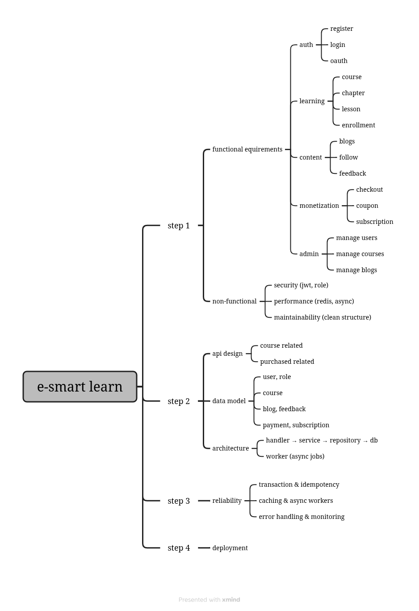

# E-Learning Backend

# Tech Stack

* Go
* Docker
* Docker Compose
* GORM + PostgreSQL
* Gin
* Air (Go hot reload)

# Project Overview



---

# Source Packages

Main backend source code is in `app/`.  
This table explains the responsibility of each package:

| Directory                  | Overview |
| -------------------------- | -------- |
| `app/main.go`              | Application entry point. |
| `app/cmd/`                 | Server bootstrap: dependency setup, environment loading, middleware, and routes. |
| `app/config/`              | Configuration loaders for database, JWT, Redis, OAuth, Stripe, MinIO, and email. |
| `app/handler/`             | Gin HTTP handlers for request parsing and response formatting. |
| `app/service/`             | Core business logic and orchestration between handlers and repositories. |
| `app/repository/`          | Data access layer (GORM repositories), custom DB types, and SQL migrations. |
| `app/model/`               | Domain/data models mapped to application entities and persistence structures. |
| `app/dto/`                 | Request and response DTOs used by **handlers** and **services**. |
| `app/apperror/`            | Application-level error definitions and mappings. |
| `app/consts/`              | Shared constants and enum-like values used across modules. |
| `app/pkg/`                 | Reusable integrations for external systems (cache, mailer, object storage). |
| `app/util/`                | Shared utility helpers (JWT helpers, validation, query builder, random helpers). |
| `app/job/`                 | Background task and payload definitions. |
| `app/worker/`              | Asynchronous workers for scheduled or event-driven tasks. |
| `app/docs/`                | Generated Swagger/OpenAPI documentation artifacts. |

Typical dependency flow:

```text
handler -> service -> repository -> database
```

Cross-cutting packages such as `config`, `consts`, `dto`, `util`, and `apperror` are shared where needed.

---

# Requirements

Make sure the following tools are installed:

* Docker
* Docker Compose
* Make

Verify installation:

```bash
docker -v
docker compose version
make -v
```

---

# Running the Project

## Start development environment

Run the project with hot reload:

```bash
make dev
```

After starting:

* Backend: http://localhost:8080/swagger//index.html
* PostgreSQL: localhost:5433

---

## Rebuild containers

If Dockerfile or dependencies change:

```bash
make dev-build
```

---

## View logs

All logs:

```bash
make logs
```

Application logs:

```bash
make logs-app
```

Database logs:

```bash
make logs-db
```

---

## Check running containers

```bash
make ps
```

---

## Restart containers

```bash
make restart
```

---

## Stop the project

```bash
make down
```

---

# Database

The project uses **PostgreSQL**.

Connection details:

```
Host: localhost
Port: 5433
User: postgres
Password: 123456
Database: elearning
```

Database initialization script:

```
script/elearning.sql
```

---

# Reset Database

To remove all database data and recreate it:

```bash
make reset-db
```

---

# Production Build

Build the production image:

```bash
make build
```

Run production containers:

```bash
make prod
```

---

# Useful Commands

| Command        | Description                   |
| -------------- | ----------------------------- |
| make dev       | Start development environment |
| make dev-build | Rebuild dev containers        |
| make logs      | Show all logs                 |
| make logs-app  | Show application logs         |
| make logs-db   | Show database logs            |
| make ps        | Show running containers       |
| make restart   | Restart containers            |
| make down      | Stop containers               |
| make reset-db  | Reset database                |

---
